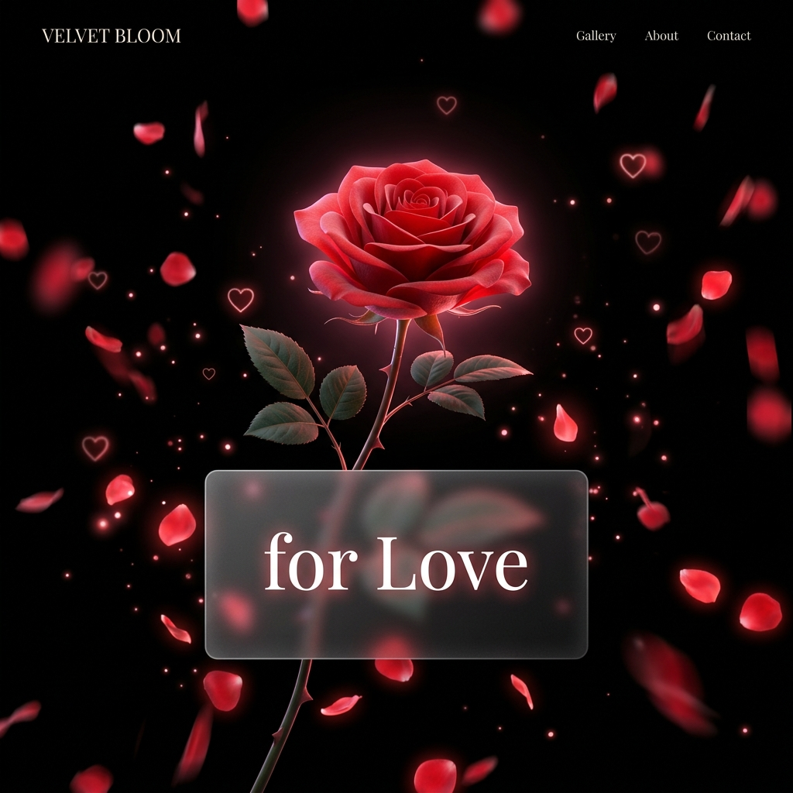

<p align="center">
  
</p>

<h1 align="center">🌹 Rose Blooming from Code</h1>

<p align="center">
  <em>A single div transforms into a beautiful blooming 3D rose — crafted entirely with HTML, CSS & JavaScript.</em>
</p>

<p align="center">
  
  
  
  
</p>

---

## ✨ What is this?

A **cinematic, interactive love letter** disguised as a web page. Watch a rose grow from a single stem, bloom petal by petal in full 3D, and reveal a heartfelt message — all powered by pure front-end magic. No frameworks. No libraries. Just code and love.

---

## 🎬 Experience

| Step | What Happens |
|------|-------------|
| 🔒 **Loading Screen** | A frosted glassmorphic card shows a progress bar with poetic status messages |
| 🌱 **Stem Grows** | The stem rises organically with leaves and thorns unfurling |
| 🌹 **Rose Blooms** | 7 layers of petals open in a staggered 3D animation with a heartbeat pulse |
| 🌸 **Petals Fall** | Delicate petals drift and sway across the viewport |
| 💕 **Hearts Float** | SVG hearts rise gently from below |
| 💌 **Love Letter** | A glassmorphic card reveals a message typed out character-by-character |
| 🎵 **Ambient Music** | A built-in Web Audio synthesizer plays a soft chord progression |

---

## 🖼️ Features

- 🎨 **Full 3D CSS Rose** — 49 individually animated petals across 7 layers with randomized jitter
- 🧊 **Glassmorphism UI** — Frosted glass cards with `backdrop-filter`, inner light highlights, and warm glows
- ⌨️ **Typewriter Letter** — Character-by-character typing animation with a blinking cursor — click to skip
- 🎵 **Generative Audio** — Real-time Web Audio API synthesizer with arpeggiated chords and delay/feedback
- ✨ **Click Sparkles** — Tap anywhere to burst emoji particles (❤, 💖, ✨, 💕, 🌸)
- 📱 **Fully Responsive** — Scales gracefully from desktop to mobile
- 🚫 **Zero Dependencies** — No frameworks, no build tools, no npm — just open `index.html`

---

## 🚀 Getting Started

```bash
# Clone the repository
git clone https://github.com/Hxni786/fun.git

# Open in your browser
cd Rose
start index.html        # Windows
open index.html         # macOS
xdg-open index.html     # Linux
```

Or simply **download the ZIP** and double-click `index.html`. That's it. ✅

---

## 📁 Project Structure

```
Rose/
├── index.html      # Markup & structure
├── style.css       # All styling, animations & glassmorphism
├── script.js       # Animation sequencing, audio synth & typewriter
├── preview.png     # Preview image for README
└── README.md       # You are here
```

---

## 🛠️ Tech Stack

| Technology | Usage |
|-----------|-------|
| **HTML5** | Semantic structure, SVG gradients |
| **CSS3** | 3D transforms, keyframe animations, glassmorphism, custom properties |
| **JavaScript** | DOM animation orchestration, Web Audio API synthesizer, typewriter engine |
| **Google Fonts** | Playfair Display, Inter, Fira Code, Dancing Script |

---

## 🎨 Design Highlights

- **Color Palette** — Deep blacks (`#020002`) to rich crimsons (`#bf0028`) with warm pink accents (`#ff4d7a`)
- **Glassmorphism** — `backdrop-filter: blur(30px) saturate(170%)` with translucent rose-tinted backgrounds
- **Typography** — Serif elegance (Playfair Display) meets modern clarity (Inter) with monospace accents (Fira Code)
- **Micro-animations** — Heartbeat pulse, floating emoji, swaying petals, blinking cursor, button shine effects

---

## 💡 Customization

| What | Where |
|------|-------|
| Change the message | Edit the `<p class="letter-body">` sections in `index.html` |
| Adjust typing speed | Modify the `speeds` array in `script.js` (lower = faster) |
| Change rose colors | Update the `.petal-*` gradient classes in `style.css` |
| Toggle music | Click the 🔊 button, or set `synth.muted = true` in `script.js` |

---

## 📜 License

This project is open source and available under the [MIT License](LICENSE).

---

<p align="center">
  <strong>Every petal blooms with love 🌹</strong>
</p>
